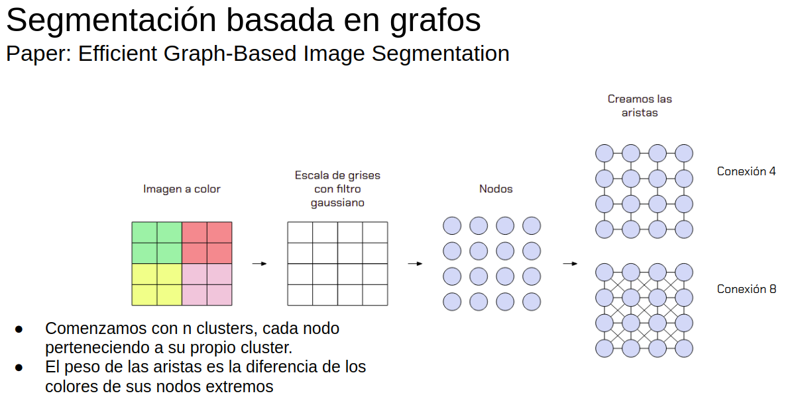
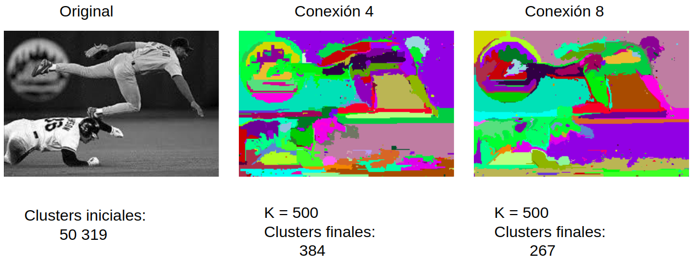
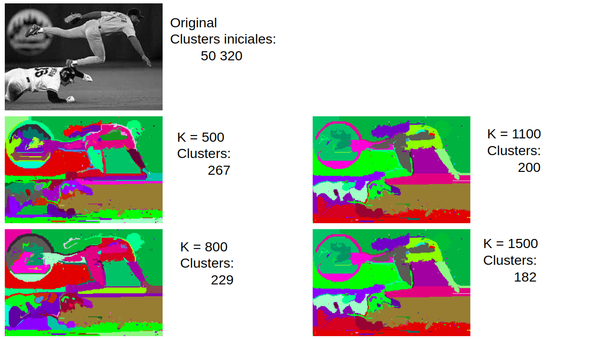
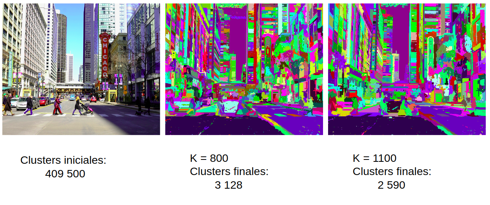
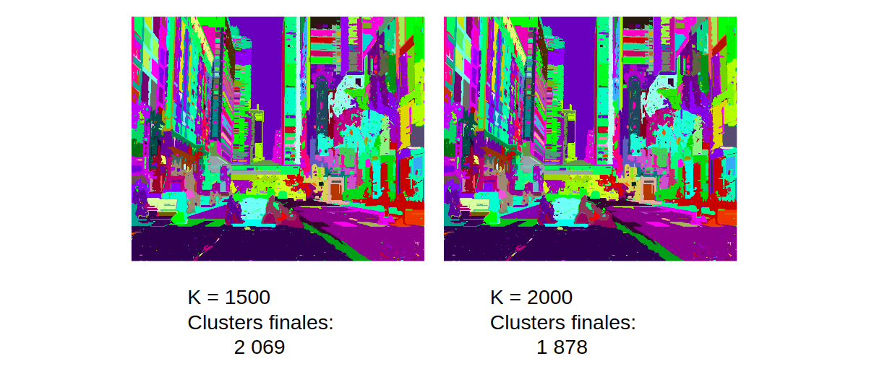
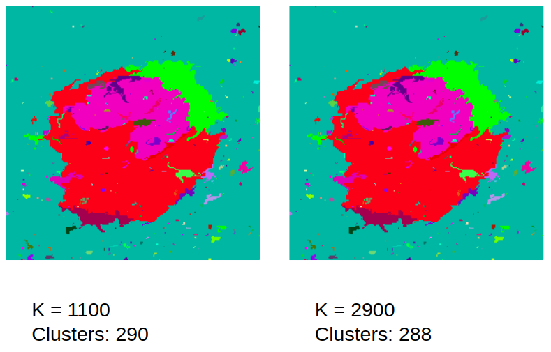
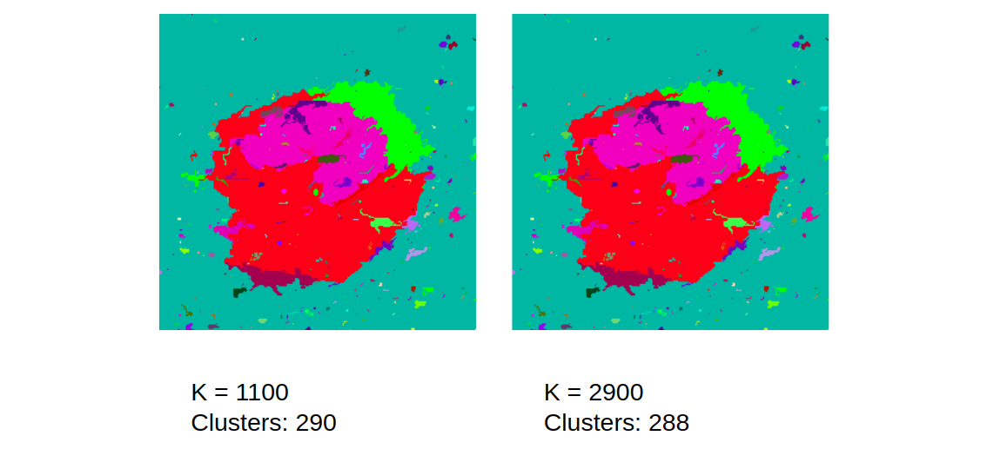

#### C++
#### Python (cv2, numpy and matplotlib.pyplot)

#### In terminal write: make
#### Creates four images with different thresholds. (See in main.cpp)

## Folders
### images_readme
Contains images for readme.md

### images_file
Contains images in RGB matrix or grayscale

### images_input
Contains the image that will be segmented

### images_output
Contains all segmented images in .png

## Files
### Graph.h and main
Graph-based segmentation implementation

### process_image_input.py
Converts the image to be segmented in a grayscale image saved in a file in images_file.

### make_image.py
Converts file of numbers in an image.

### make_four_image.py
Converts 4 files in 4 images at the same time, because it assigned random colors to clusters id. The id is assigned in order of the size of every segment. The bigger the segment is, it has less id. The biggest segment in every photo has the same id, 0. Segments in the same order will be the same color and therefore can be noticed how the clusters changed with different thresholds.

# Results

