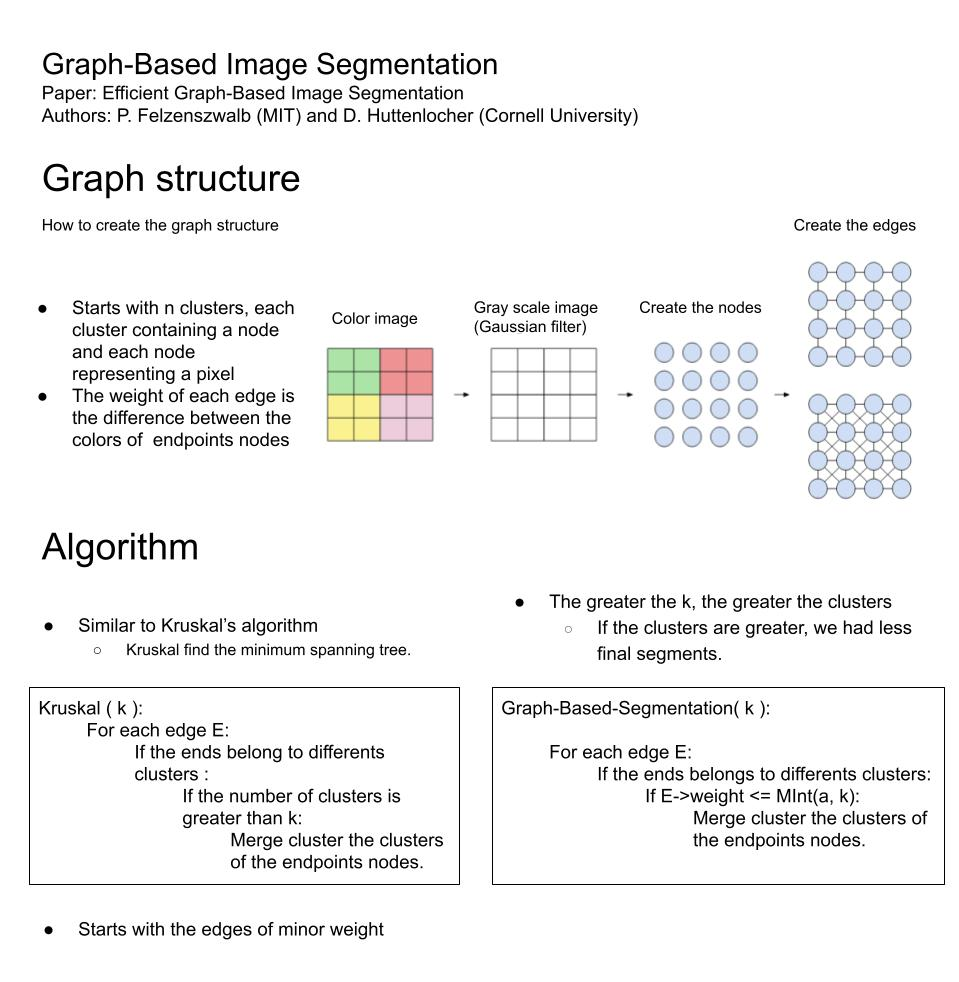
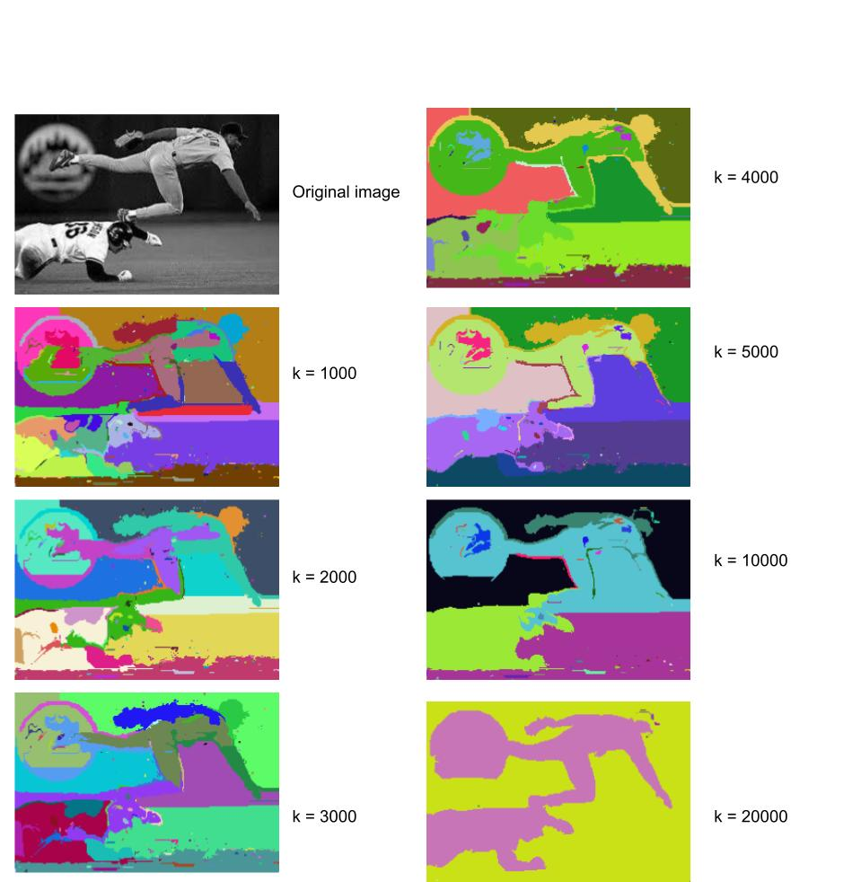

#### C++
#### Python (cv2, numpy, shutil, os and matplotlib.pyplot)

### Folders
images_readme: Contains images for readme.md 

images_input: Contains all the images that will be segmented 

images_output: Contains all segmented images in png 

### Files
#### Graph.h and main.cpp
Graph-based segmentation implementation

### process_image_input.py
Converts all input images in a grayscale image and saves it in a temporal file

#### make_image.py
Converts the segmented images in images.
